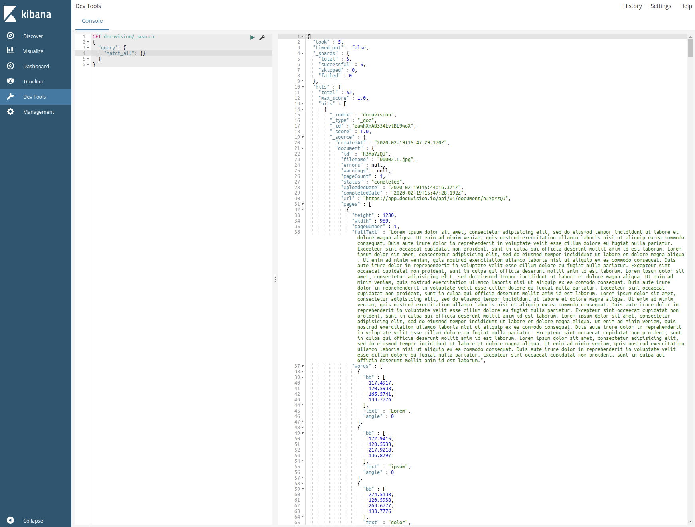

<p align="center">
    
    <br/>
    
    
</p>

<h1 align="center">
    Docuvision Studio NodeJS file indexer CLI
</h1>
  
<p align="center">
  Convert documents to data with <a href="https://docuvision.io/">Docuvision</a>, and make the results searchable with <a href="https://www.elastic.co/">elasticsearch</a>
</p>

## Prerequisites

 - [NodeJS](https://nodejs.org/en/) (minimum: node 10, recommended: 12 or above)  

## Getting started

From the command line of choice, in this directory:

```bash
# Install dependencies
npm install

# Copy environment varaibles file
cp .env.example .env

# Transpile
npm run build
```

You should then add your Docuvision api key to the `.env` file.
```bash
HOST=http://localhost:8100/v1
DOCUVISION_APIKEY=<your_api_key_goes_here>
```

For example, your `.env` configuration may look like:
```bash
HOST=http://localhost:8100/v1
DOCUVISION_APIKEY=521.85KMj60CcaXc9fl6N0kO0rqbW7pgsm3ALzkFw0m1sE3cjkj0F8i4PV39Z21hGC56
```


## Usage

```bash
npm run index <list_of_files_or_folders>
```
where `<list_of_files_or_folders>` is a list of files or folders. It is recommended that each file/folder be quoted (eg `npm run index "example with spaces.pdf"`) to avoid any issues with filenames. More [examples](#index-examples) are listed below.  

You can also run in watch mode for a sungle file or folder:
```bash
npm run index -- --watch <file_or_folder>
```

#### Examples:

Index a folder:
```bash
npm run index /home/billy/Documents/to_docuvise/
```

Index a file:
```bash
npm run index /home/billy/Pictures/cat.png
```

Index both:
```bash
npm run index /home/billy/Pictures/cat.png /home/billy/Documents/to_docuvise/ /home/billy/Documents/cats.pdf
```

## Advanced

### Using kibana ([docs](https://www.elastic.co/kibana))
You can view index results in Kibana - and instance of it is running in docker at [http://localhost:5601/](http://localhost:5601/app/kibana#/dev_tools/console?_g=())


