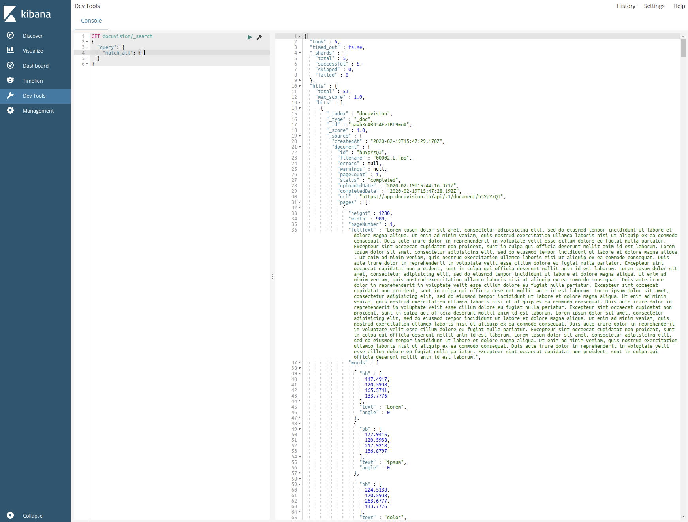

<p align="center">
    
    
</p>
<span>TODO: get better Docuvision img</span>

<h1 align="center">
    DocuSearch NodeJS CLI
</h1>
  
<p align="center">
  Convert documents to data with <a href="https://docuvision.io/">Docuvision</a>, and make the results searchable with <a href="https://www.elastic.co/">elasticsearch</a>
</p>

## Prerequisites

 - [Docker](https://www.docker.com/)  


 - [docker-compose](https://docs.docker.com/compose/)  


 - [NodeJS](https://nodejs.org/en/) (minimum: node 10, recommended: 12 or above)  

## Getting started

From the command line of choice, in this directory:

```bash
# Install dependencies
npm install

# Start docker
npm run docker

# Copy environment varaibles file
cp .env.example .env

# Transpile
npm run build
```

You should then add your Docuvision api key to the `.env` file.
```bash
# Elastic
ELASTICSEARCH_NODE=http://localhost:9200
ELASTICSEARCH_INDEX=docuvision

# Docuvision
DOCUVISION_HOST=https://app.docuvision.io/api
DOCUVISION_APIKEY=<your_api_key_goes_here>
```

For example, your `.env` configuration may look like:
```bash
# Elastic
ELASTICSEARCH_NODE=http://localhost:9200
ELASTICSEARCH_INDEX=my_receipt_collection

# Docuvision
DOCUVISION_HOST=https://app.docuvision.io/api
DOCUVISION_APIKEY=521.85KMj60CcaXc9fl6N0kO0rqbW7pgsm3ALzkFw0m1sE3cjkj0F8i4PV39Z21hGC56
```


## Usage

There are 2 main commands:  

**Indexing Files**

```bash
npm run index <list_of_files_or_folders>
```
where `<list_of_files_or_folders>` is a list of files or folders. It is recommended that each file/folder be quoted (eg `npm run index "example with spaces.pdf"`) to avoid any issues with filenames. More [examples](#index-examples) are listed below.  

You can also run in watch mode for a sungle file or folder:
```bash
npm run index -- --watch <file_or_folder>
```

**Searching Indexed Files**

```bash
npm run search <search_terms>
```
where `<search_terms>` are search terms. More [examples](#search-examples) are listed below.  


### Index files / folders

```bash
npm run index <list_of_files_or_folders>
```

#### Index examples:

Index a folder:
```bash
npm run index /home/billy/Documents/to_docuvise/
```

Index a file:
```bash
npm run index /home/billy/Pictures/cat.png
```

Index both:
```bash
npm run index /home/billy/Pictures/cat.png /home/billy/Documents/to_docuvise/ /home/billy/Documents/cats.pdf
```

While processing, you will see the status of the indexing
```
Processing...
total            : 67       // Total files found
pending          : 12       // Waiting for processing to finish
skipped existing : 0        // Skiped as the file exists in the index
completed        : 53       // Done processing
failed           : 2        // Did not successfully process
Avg fail time    : 0.78s    // Prolly wont keep these (dev only?)
Avg success time : 1.18s    // Prolly wont keep these (dev only?)
Elapsed          : 3.14s    // Total time running
```

### Search indexed documents

```bash
npm run search <search_terms>
```
or
```bash
npm run search <search_terms> size=<integer> from=<integer>
# eg:
# npm run search cat pictures size=50 from=10
# NOTE: both size and from are optional, you can specify zero, one, or both
```

where `size` and `from` control paging (`size` is number per-page, `from` is offset to start from)  

#### Search Examples

Search through indexed files:
```bash
npm run search my cat picture
```

Search through indexed files (with paging):
```bash
npm run search my cat picture size=2 from=100
```

Ouput will look something like this:
```bash
npm run find lorem size=2
```

```
{
  "id": "zq8EtapK_",
  "filename": "sub2page.pdf",
  "errors": null,
  "warnings": null,
  "pageCount": 2,
  "status": "completed",
  "uploadedDate": "2020-02-21T17:01:00.511Z",
  "completedDate": "2020-02-21T17:04:41.299Z",
  "url": "https://docuvision.io/api/v1/document/zq8EtapK_",
  "pages": [
    {
      "height": 685,
      "width": 1280,
      "pageNumber": 1,
      "fullText": "1 Lorem ipsum dolor sit",
      "words": [
          {
            "bb": [
              24.5153,
              7.1593,
              27.9864,
              15.4034
            ],
            "text": "1",
            "angle": 0
          },
          {
            "bb": [
              48.8136,
              7.1593,
              79.6203,
              15.4034
            ],
            "text": "Lorem",
            "angle": 0
          }
          // ...many more words
      ],
      "errors": null,
      "status": "completed",
      "imgUrl": "https://docuvision.io/api/v1/document/zq8EtapK_/1.jpg"
    },
    // ...many more pages
  ],
  "fromPage": 1,
  "toPage": 50
}
{
  "id": "2KCGPSSPV",
  "filename": "sub.pdf",
  "errors": null,
  "warnings": null,
  "pageCount": 1,
  "status": "completed",
  "uploadedDate": "2020-02-21T17:01:00.510Z",
  "completedDate": "2020-02-21T17:04:12.638Z",
  "url": "https://docuvision.io/api/v1/document/2KCGPSSPV",
  "pages": [
    {
      "height": 685,
      "width": 1280,
      "pageNumber": 1,
      "fullText": "1 Lorem ipsum dolor sit: amet, consectetur adipisicing elit",
      "words": [
          {
            "bb": [
              24.5153,
              7.1593,
              27.9864,
              15.4034
            ],
            "text": "1",
            "angle": 0
          },
          {
            "bb": [
              48.8136,
              7.1593,
              79.6203,
              15.4034
            ],
            "text": "Lorem",
            "angle": 0
          },
          {
            "bb": [
              86.7797,
              6.2915,
              117.5864,
              18.0068
            ],
            "text": "ipsum",
            "angle": 0
          }
          // ...many more words
      ],
      "errors": null,
      "status": "completed",
      "imgUrl": "https://docuvision.io/api/v1/document/2KCGPSSPV/1.jpg"
    }
  ],
  "fromPage": 1,
  "toPage": 50
}
showing 2 of 19 results
```

## Advanced

## Using the Docuvision client API (see the [docs](https://docs.docuvision.io/) for example usage)

### Initialize

```typescript
import { Client } from './docuvision/docuvision';

const docuvisionClient = new Client();

// NOTE: The client will use the DOCUVISION_APIKEY environment variable by default.
// if you want to use a different api key, you can pass it into the client config:
// new Client({ apiKey: process.env.DOCUVISION_APIKEY });
```

### Upload ([docs](https://docs.docuvision.io/index.html#upload-a-document-or-image))

```typescript
const myCatUpload = await docuvisionClient.upload({ file: './cat-pictures/maine.jpg' });
console.log(myCatUpload.body);
```

```typescript
{ 
  status: 'pending', 
  id: 'S_FVCfQI', 
  url: 'https://app.docuvision.io/api/v1/documents/S_FVCfQI'
}
```
You can then poll the API for the completed document (see [getting documents](#get-a-pending-or-completed-document) below).  

### Get a pending or completed document ([docs](https://docs.docuvision.io/index.html#get-document-content))

```typescript
const response = await docuvisionClient.getDocument({ id: myCatUpload.body.id });
console.log(response.body);
```

or poll for completion using your favourite method:

```typescript
let response;
do {
    await new Promise(res => setTimeout(res, 1000));
    response = await docuvisionClient.getDocument({ id: myCatUpload.body.id });
} while(response.body.status !== 'completed');
```

for a processing document, you will get something like this:
```typescript
{
    id : 'S_FVCfQI',
    filename : 'maine.jpg',
    errors : null,
    warnings : null,
    status : 'pending',
    pageCount: 1,
    uploadedDate: '2020-02-19T15:19:56.295Z',
    completedDate: null,
    url: 'https://app.docuvision.io/api/v1/document/S_FVCfQI',
    pages: [],
    fromPage: 'undefined',
    toPage: 'undefined'
}
```

for a completed document, you will get something like this:
```typescript
{
    id: 'S_FVCfQI',
    filename: 'maine.jpg',
    errors: null,
    warnings: null,
    pageCount: 1,
    status: 'completed',
    uploadedDate: '2020-02-19T13:26:21.551Z',
    completedDate: '2020-02-19T13:29:15.522Z',
    url: 'https://app.docuvision.io/api/v1/document/S_FVCfQI',
    pages: [
        {
            height: 1280,
            width: 986,
            pageNumber: 1,
            fullText: 'this is a picture of my favouritest cat!',
            words: [
                {
                    bb: [26.2834, 27.5975, 61.7659, 38.1109],
                    text: 'this',
                    angle: 0
                },
                {
                    bb: [70.308, 23.655, 105.1335, 42.7105],
                    text: 'is',
                    angle: 0
                },
                //...,
                {
                    bb: [106.4476, 27.5975, 111.0472, 38.1109],
                    text: 'cat!',
                    angle: 0
                }
            ]
        }
        // image files will always have 1 page
    ],
    fromPage: 1,
    toPage: 50
}
```

### List all uploads ([docs](https://docs.docuvision.io/index.html#list-uploaded-documents))

```typescript
const response = await docuvisionClient.listDocuments({ offset: 10, limit: 100 });
console.log(response.body);
```

```typescript
{
    data: [
        {
            id: 'S_FVCfQI',
            filename: 'maine.jpg',
            errors : null,
            warnings : null,
            pageCount : 1,
            status: 'completed',
            uploadedDate: '2020-02-19T13:26:21.551Z',
            completedDate: '2020-02-19T13:29:15.522Z',
            url: 'https://app.docuvision.io/api/v1/document/S_FVCfQI',
        },
        //... many more cat uploads
    ],
    limit: 100,
    offset: 10,
    total: 600
}
```

### Delete ([docs](https://docs.docuvision.io/index.html#delete-an-uploaded-document))

```typescript
const { statusCode, text } = await docuvisionClient.deleteDocument({ docId: 'S_FVCfQI' });
console.log({ statusCode, text });
```

```typescript
{ 
    statusCode: 200, 
    text: 'true'
}
```

### Handling errors
The client will reject any non-200-level status codes

```typescript
await docuvisionClient.upload({ file: './cat-pictures/maine.json' })
    .catch(error => console.error(error.body));
```

```typecsript
{ 
    statusCode: 422, 
    message: 'Unsupported file extension.'
}
```


### Using kibana ([docs](https://www.elastic.co/kibana))
You can view index results in Kibana - and instance of it is running in docker at [http://localhost:5601/](http://localhost:5601/app/kibana#/dev_tools/console?_g=())


